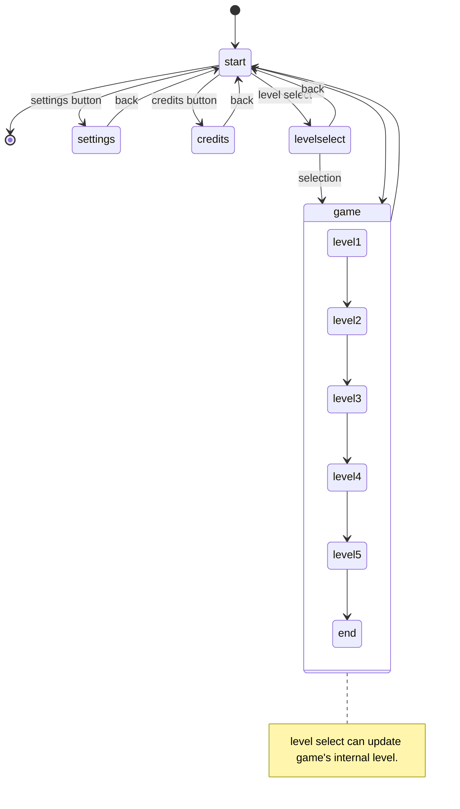

# menus

```mermaid
stateDiagram-v2
    [*] --> start
    start --> [*]

    start --> settings : settings button
    settings --> start : back

    start --> credits : credits button
    credits --> start : back

    start --> levelselect : level select
    levelselect --> start : back
    levelselect --> game : selection

    start --> game
    game --> start
    state game {
        level1 : level1
        level1 --> level2

        level2 --> level3

        level3 --> level4

        level4 --> level5

        level5 --> end
    }
    note right of game
        level select can update game's internal level.
    end note


```
